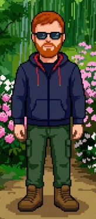

# ABOUT ME

  

    <!-- FRONT -->
    

      

        <h3 class="tc-title">TRAINER CARD</h3>
        IDNo. 02001
      

      

        

          
NAMEFABIO

          
CLASSMLE

          
LEVEL1

          
ARTICLES<!--ARTICLE_COUNT-->

          
INTERESTSTECH

          
QUESTGAIN EXP

        

        

          
        

      

      

        
<svg viewBox="0 0 24 24"><use href="#badge-1"/></svg>

        
<svg viewBox="0 0 24 24"><use href="#badge-2"/></svg>

        
<svg viewBox="0 0 24 24"><use href="#badge-3"/></svg>

        
<svg viewBox="0 0 24 24"><use href="#badge-4"/></svg>

        
<svg viewBox="0 0 24 24"><use href="#badge-5"/></svg>

        
<svg viewBox="0 0 24 24"><use href="#badge-6"/></svg>

        
<svg viewBox="0 0 24 24"><use href="#badge-7"/></svg>

        
<svg viewBox="0 0 24 24"><use href="#badge-8"/></svg>

      

      <button class="tc-flip-btn" onclick="document.getElementById('tcFlip').classList.add('flipped')">BADGES ▶</button>
    

    <!-- BACK -->
    

      

        <h3 class="tc-title">BADGE CASE</h3>
        IDNo. 02001
      

      

        

<svg viewBox="0 0 24 24"><use href="#badge-1"/></svg>
Spark — Publish your 1st article

        

<svg viewBox="0 0 24 24"><use href="#badge-2"/></svg>
Quill — Publish 5 articles

        

<svg viewBox="0 0 24 24"><use href="#badge-3"/></svg>
Tide — Write a 3000+ word deep dive

        

<svg viewBox="0 0 24 24"><use href="#badge-4"/></svg>
Forge — Document a full project end-to-end

        

<svg viewBox="0 0 24 24"><use href="#badge-5"/></svg>
Streak — Post consistently for 6 months

        

<svg viewBox="0 0 24 24"><use href="#badge-6"/></svg>
Lore — Reach 25 published articles

        

<svg viewBox="0 0 24 24"><use href="#badge-7"/></svg>
Signal — Get featured or cited externally

        

<svg viewBox="0 0 24 24"><use href="#badge-8"/></svg>
Legend — 100 articles. You are the champion.

      

      <button class="tc-flip-btn" onclick="document.getElementById('tcFlip').classList.remove('flipped')">◀ BACK</button>
    

  

Hey, I'm Fabio! Nice to meet you!

I'm a machine learning engineer who enjoys building things, exploring new tech, and occasionally going down deep rabbit holes just to see where they lead.

This blog is my little space on the internet. I will document what I break, what I fail, what I build, and what I find worth sharing, hoping no one will make the same mistakes I do.

---

## FIND ME

  <a href="https://github.com/fabioscantamburlo" class="social-btn" target="_blank">
    <svg viewBox="0 0 24 24"><path d="M12 0C5.37 0 0 5.37 0 12c0 5.31 3.435 9.795 8.205 11.385.6.105.825-.255.825-.57 0-.285-.015-1.23-.015-2.235-3.015.555-3.795-.735-4.035-1.41-.135-.345-.72-1.41-1.23-1.695-.42-.225-1.02-.78-.015-.795.945-.015 1.62.87 1.845 1.23 1.08 1.815 2.805 1.305 3.495.99.105-.78.42-1.305.765-1.605-2.67-.3-5.46-1.335-5.46-5.925 0-1.305.465-2.385 1.23-3.225-.12-.3-.54-1.53.12-3.18 0 0 1.005-.315 3.3 1.23.96-.27 1.98-.405 3-.405s2.04.135 3 .405c2.295-1.56 3.3-1.23 3.3-1.23.66 1.65.24 2.88.12 3.18.765.84 1.23 1.905 1.23 3.225 0 4.605-2.805 5.625-5.475 5.925.435.375.81 1.095.81 2.22 0 1.605-.015 2.895-.015 3.3 0 .315.225.69.825.57A12.02 12.02 0 0024 12c0-6.63-5.37-12-12-12z"/></svg>
    GitHub
  </a>
  <a href="https://www.linkedin.com/in/fabio-scantamburlo-5b427614b/" class="social-btn" target="_blank">
    <svg viewBox="0 0 24 24"><path d="M20.447 20.452h-3.554v-5.569c0-1.328-.027-3.037-1.852-3.037-1.853 0-2.136 1.445-2.136 2.939v5.667H9.351V9h3.414v1.561h.046c.477-.9 1.637-1.85 3.37-1.85 3.601 0 4.267 2.37 4.267 5.455v6.286zM5.337 7.433a2.062 2.062 0 01-2.063-2.065 2.064 2.064 0 112.063 2.065zm1.782 13.019H3.555V9h3.564v11.452zM22.225 0H1.771C.792 0 0 .774 0 1.729v20.542C0 23.227.792 24 1.771 24h20.451C23.2 24 24 23.227 24 22.271V1.729C24 .774 23.2 0 22.222 0h.003z"/></svg>
    LinkedIn
  </a>
  <a href="https://www.kaggle.com/faibioss" class="social-btn" target="_blank">
    <svg viewBox="0 0 24 24"><path d="M18.825 23.859c-.022.092-.117.141-.281.141h-3.139a.626.626 0 01-.424-.177l-5.41-6.638-1.494 1.424v5.043a.344.344 0 01-.353.353H5.691a.344.344 0 01-.353-.353V.353A.344.344 0 015.691 0h2.033a.344.344 0 01.353.353v13.467l6.551-6.692a.744.744 0 01.494-.212h3.281c.117 0 .199.046.246.141a.262.262 0 01-.024.281l-7.27 7.058 7.552 9.18c.07.094.086.188.047.282z"/></svg>
    Kaggle
  </a>

